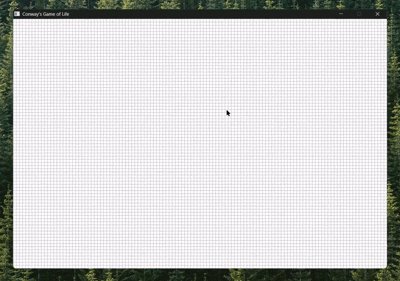

# Conway’s Game of Life (SDL3)

A simple interactive implementation of Conway’s Game of Life using SDL3.
You can draw an initial pattern and watch it evolve based on the cellular automata rules.
Grid size and speed can be adjusted in the source code.

## Controls
- Left click: erase cell
- Right click: add cell
- Space: clear grid
- Enter: start simulation
- Esc: pause / resume
- E: stop simulation

## Demo

